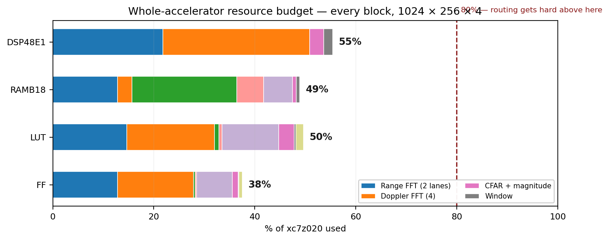

# Does It All Fit? — Whole-Chip Budget

Every block in the accelerator, at your fixed dimensions **1024 × 256 × 4**, on
**xc7z020**. Not just the FFT blocks — everything that has to share the die.

---

## The answer

| resource | used | available | % | verdict |
|---|---:|---:|---:|---|
| DSP48E1 | 122 | 220 | **55 %** | fits |
| RAMB18 | 137 | 280 | **49 %** | fits |
| LUT | 26,418 | 53,200 | **50 %** | fits |
| FF | 39,932 | 106,400 | **38 %** | fits |

**Everything fits with roughly half the chip spare.** That matters — above ~80 % on a
Zynq-7 the router starts fighting you and timing closure gets painful. At 50 % it will
place and route without drama.

---

## Block-by-block

| block | DSP | RAMB18 | LUT | FF | basis |
|---|---:|---:|---:|---:|---|
| Range FFT — 2 lanes, N=2048 | 48 | 36 | 7,818 | 13,632 | **MEASURED** |
| Doppler FFT — 4 lanes, N=256 | 64 | 8 | 9,200 | 16,000 | estimate |
| Working buffer + address gen | 0 | 58 | 500 | 400 | calculated |
| Input ping-pong buffer | 0 | 15 | 300 | 300 | calculated |
| AXI DMA + SmartConnect + CSR | 0 | 16 | 6,000 | 7,500 | estimate |
| CFAR + magnitude | 6 | 2 | 1,600 | 1,200 | estimate |
| Window function — 2 lanes | 4 | 2 | 200 | 200 | calculated |
| Angle FFT + FIFOs + glue | 0 | 0 | 800 | 700 | estimate |
| **Total** | **122** | **137** | **26,418** | **39,932** | |

Only the range lane row is measured — from the actual implementation run. The rest are
engineering estimates and will move, but not by 2×.

Note what dominates each column:

- **DSP** is the FFT engines (112 of 122). Everything else is noise.
- **BRAM** is the working buffer (58) and the range engines (36). Memory, as always.
- **LUT** is split between the FFT engines and the AXI infrastructure.

---

## What stays exactly the same

Your entire frozen specification survives:

| | value |
|---|---|
| Cube | 1024 range × 256 chirps × 4 RX |
| Clock | 100 MHz, PS `FCLK_CLK0` |
| Data format | complex Q1.15, 16-bit |
| Arithmetic | Block Floating Point |
| Rounding | convergent |
| Per-lane throughput | 1 sample/clock |
| Interfaces | AXI-Stream, full backpressure |
| Runtime size switching | yes |
| Device | xc7z020, Zybo Z7-20 |

---

## What has to change — four items, all need sign-off

**1. Two range lanes, not one.**
Input is 102.4 MSPS (1,048,576 samples / 10.24 ms). One lane is 100 MSPS. Two lanes, each
handling 2 antennas at 51.2 MSPS. Costs 24 extra DSPs.
*Alternative:* one lane at 110 MHz — post-route Fmax measured at 138 MHz, so there is room.
That saves 24 DSPs but breaks the 100 MHz spec.

**2. The FFT engine outputs complex, not magnitude.**
Magnitude moves to after the Doppler and angle stages. Doppler and AoA are coherent — they
need phase. Squaring at the range stage makes the rest of the chain impossible. Same 32 bits
per bin, same bandwidth, two DSPs cheaper.

**3. Only one corner turn, not two.**
Four parallel Doppler engines mean all 4 antennas of a cell emerge together and feed the
4-point angle FFT directly. The second transpose is deleted. **This is the change that makes
the DDR bandwidth work** — 40 % traffic reduction. It also changes the memory block's scope,
so your teammate needs to be in this conversation.

**4. CFAR runs on-chip, before writeback.**
Write out a target list, not the cube. Another 30 % off DDR traffic. If CFAR was planned for
software on the ARM, it moves into the PL.

---

## The two numbers that are not proven

**DDR bandwidth.** The whole design assumes ~2.5 GB/s achievable with strided access against
a 4.26 GB/s peak. That is an estimate. **Benchmark it on the Zybo before building anything**
— a day's work that de-risks the entire architecture. If it comes back at 1.5 GB/s, the
design still works (0.82 GB/s needed) but the margin shrinks from 3× to 1.8×.

**Doppler engine resources.** 16 DSP and 2 RAMB18 per N=256 engine follows the measured
radix-2² rule (⌈log₄256⌉ = 4 multipliers × 4 DSP). Confirm by building one IP — twenty
minutes, and it firms up 64 of the 122 DSPs in this table.

---

## Bottom line

At your fixed dimensions, on the chip you have, with the specification unchanged:
**it fits at about half the device**, with 2× throughput margin over real time and 3×
margin on DDR bandwidth.

The constraint that nearly killed it was never the FFT — it was moving 4.2 MB through a
64-bit port five times per frame. Deleting one corner turn and detecting before writeback
takes that from 2.05 GB/s to 0.82 GB/s, and that is the difference between a design that
works and one that does not.
